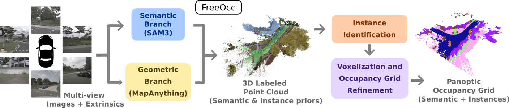

# FreeOcc

Official repository for **FreeOcc: Training-free Panoptic Occupancy Prediction via Foundation Models**.

Paper:

- arXiv: [https://arxiv.org/abs/2603.06166](https://arxiv.org/abs/2603.06166)
- Local copy: [docs/2603.06166v1.pdf](docs/2603.06166v1.pdf)



## Overview

This repository provides the data-preparation and evaluation utilities used around the FreeOcc paper, with a focus on reproducibility for NuScenes / Occ3D-style semantic and panoptic occupancy benchmarks.

Current contents include:

- panoptic benchmark preparation for Occ3D-NuScenes
- semantic occupancy, RayIoU, and RayPQ evaluation code
- NuScenes support code used by the released utilities
- validation and compatibility tests

## Repository Layout

- `FreeOcc/eval/`: semantic occupancy, ray-based, and panoptic metrics
- `FreeOcc/tools/`: evaluation scripts and benchmark-preparation scripts
- `FreeOcc/datasets/nuscenes/`: NuScenes helpers used by evaluation and preparation code
- `lib/dvr/`: CUDA/C++ DVR backend used by ray-based utilities

## Data Preparation

### Panoptic Occ3D Preparation

`FreeOcc.tools.prepare_panoptic_benchmark` generates `labels_pano.npz` files for Occ3D-NuScenes.

What it does:

- reads semantic occupancy labels from `data/occ3d_nuscenes/gts/<scene>/<token>/labels.npz`
- also supports Occ3D roots with or without a top-level `gts/` directory
- reads NuScenes info PKLs from `data/nuscenes`, or from an explicit `--info_path`
- supports both common schemas:
  - SparseOcc / MMCV style: `{"infos": [...]}`
  - MMDet3D v1 style: `{"metainfo": ..., "data_list": [...]}`
- supports `--scene_split train`, `val`, and `all`
- writes `labels_pano.npz` next to each sample GT
- preserves the base label arrays and adds an `instances` array for panoptic evaluation
- skips existing outputs unless `--overwrite` is set

Generate panoptic labels:

```bash
python -m FreeOcc.tools.prepare_panoptic_benchmark \
  --nuscenes_root data/nuscenes \
  --occ3d_root data/occ3d_nuscenes
```

Useful options:

- `--scene_split all`
- `--overwrite`
- `--num_workers N`
- `--progress_path /tmp/prepare_panoptic_benchmark_progress.json`
- `--failed_tokens_path /tmp/prepare_panoptic_benchmark_failed_tokens.txt`

Validate generated annotations:

```bash
python -m FreeOcc.tests.test_prepare_panoptic_benchmark \
  --occ3d_root data/occ3d_nuscenes \
  --split val \
  --num_samples_to_check 20
```

If generation is intentionally partial, add `--allow_missing_outputs`.

## Evaluation

### Prediction Layouts

The evaluation scripts support two input layouts.

Experiment-folder layout:

- semantic grid:
  `results/occ3d_nuscenes/exps/<exp_name>/<scene_name>/<sample_token>/occ_grid_occ3d_nuscenes.npy`
- instance grid for RayPQ:
  `results/occ3d_nuscenes/exps/<exp_name>/<scene_name>/<sample_token>/occ_grid_instances.npy`

Token-wise NPZ layout:

- `<pred_dir>/<sample_token>.npz`
- default semantic key: `pred`
- default instance key for RayPQ: `pano_inst`

### RayIoU / RayPQ

`FreeOcc.tools.eval_ray_metrics` evaluates RayIoU and RayPQ from either experiment-folder outputs or token-wise `.npz` predictions.

By default, pose information for ray evaluation is loaded from raw NuScenes metadata. For stricter SparseOcc-style reproduction, `--sparseocc_exact_mode` can be used with SparseOcc infos PKLs.

Run RayIoU:

```bash
python -m FreeOcc.tools.eval_ray_metrics \
  --exp_path results/occ3d_nuscenes/exps/your_exp_name \
  --nuscenes_root data/nuscenes \
  --occ3d_root data/occ3d_nuscenes
```

Run RayIoU + RayPQ:

```bash
python -m FreeOcc.tools.eval_ray_metrics \
  --exp_path results/occ3d_nuscenes/exps/your_exp_name \
  --compute_raypq \
  --gt_label_name labels_pano.npz \
  --nuscenes_root data/nuscenes \
  --occ3d_root data/occ3d_nuscenes
```

Useful options:

- `--pred_dir <dir>` instead of `--exp_path`
- `--thing_only`
- `--get_per_scene_confusion`
- `--sparseocc_exact_mode`
- `--sparseocc_infos_pkl <path>`

### Combined Metrics

`FreeOcc.tools.eval_all_metrics` recomputes semantic occupancy metrics and RayIoU in one pass, and can also compute RayPQ.

```bash
python -m FreeOcc.tools.eval_all_metrics \
  --exp_path results/occ3d_nuscenes/exps/your_exp_name \
  --compute_raypq \
  --nuscenes_root data/nuscenes \
  --occ3d_root data/occ3d_nuscenes
```

This script reports:

- `mIoU`
- `IoU_occupied`
- `IoU_free`
- per-class IoUs
- RayIoU
- RayPQ when `--compute_raypq` is enabled

### Per-Sample Evaluation

`FreeOcc.tools.eval_by_sample` evaluates one scene sample by sample and saves a `results_per_sample.csv`.

```bash
python -m FreeOcc.tools.eval_by_sample \
  --exp_folder results/occ3d_nuscenes/exps/your_exp_name/scene-0001 \
  --dataset_name nuscenes
```

## Compatibility Notes

The ray-metric implementation is designed to stay compatible with the evaluation logic used in SparseOcc and GaussianFlowOcc, and the DVR backend is loaded from `lib/dvr/` first.

Compatibility / sanity checks:

```bash
python -m FreeOcc.tests.test_ray_metrics_compatibility
python -m FreeOcc.tests.test_instance_grid_generation
```

## Optional Ray-Metric Environment

For ray metrics and DVR-backed tools, a dedicated environment can be useful:

```bash
micromamba create -n rayeval python=3.8 -y
micromamba activate rayeval
pip install torch==1.11.0+cu113 torchvision==0.12.0+cu113 torchaudio==0.11.0+cu113 -f https://download.pytorch.org/whl/torch_stable.html
pip install numpy==1.23.5 nuscenes-devkit pyquaternion tqdm prettytable pillow ninja pandas pyyaml
```

## Acknowledgments
We would like to thank the following projects for their code and resources:
- [SparseOcc](https://github.com/MCG-NJU/SparseOcc) for data-preparation and evaluation code foundations.
- [MMDetection3D](https://github.com/open-mmlab/mmdetection3d) for training experiment infrastructure.
- [STCOcc](https://github.com/lzzzzzm/STCOcc) for experiment code and configurations.
- This project was provided with computing AI and storage resources by GENCI at IDRIS thanks to the grant `2026-AD011012128R5` on the supercomputer Jean Zay's H100 partition.
